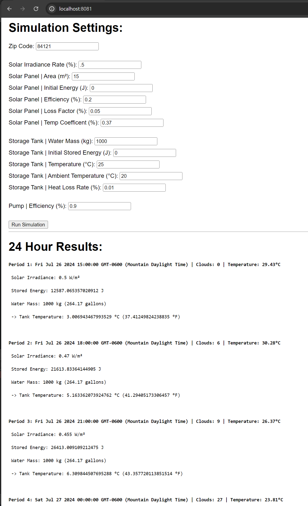

# SimulationTest
 

## How to Run

1. Build the project: (CLI at root of project directory)
`npx webpack`

2. Start the HTTP server:
`http-server`

3. Visit the URL specified in terminal (most likely `http://localhost:8080`)

4. Update simulation parameters (or use the supplied defaults)

5. Click "Run Simulation" button

6. Results should be displayed below "24 Hour Results:"

## Time Spent

I spent roughly 4-5 hours on the following tasks:

- 20mins: Setup Project
- 45mins: Draft initial program design/class objects
- 30mins: Layout simulation procedure and loop
- 30mins: Log values/display HTML elements
- 30mins: Storage tank energy transfer logic
- 45mins: Solar panel energy logic and research
- 30mins: Research and implement OpenWeatherMap API 
- 20mins: Cleanup/small tweaks and improvements 
- 30mins: Attempt to more accurately model solar energy
- 15mins: README instructions/potential improvements

## Other Potential Improvements

If I had spent additional time on this I would have considered other areas for improvements:

- More accurately model solar energy dynamics. I've admittedly never worked with solar panels before, and I'm attempting to defer the correct measurements and conversion rates based on information I've referenced online. I'm including a grossly simplified calculation of this logic that I'm not entirely sure is completely scientifically accurate. I'm using incoming values which are largely arbitrary based on a basic model referencing solar panel size, a irradiance rate, the time of day. As well as temperature and cloud cover data coming from OpenWeatherMap API services. I spent some time looking into referencing their Solar Irradiance API, however was unable to reference this data with just a basic subscription plan. 

- Factor in architectural and surrounding objects in factors on how they might block or reflect energy to the solar panel(s).

- Upgrade the model that is being used for energy loss. Perhaps I could have included losses due to energy conversion processes, such as from solar energy to electrical energy and then to thermal energy.

- Heat Loss Coefficient: Instead of a fixed heat loss rate for the storage tank, I could have tried to model a heat loss coefficient based on the insulation quality and surface area of the storage tank. In addition perhaps more accurate results could be provided when considering the thermal stratification within the storage tank, where the temperature varies at different heights within the tank. This might also include a model for mixing effects if a pump or external conditions cause water in the tank to mix.

- Ensure the system handles more radical edge cases circumstances, such as extremely low solar intensity or very high ambient temperatures, and perhaps report warnings under these extreme conditions.

- Separate the class objects and simulation logic into individual files. This would be ideal for a application that is growing in size, however for this simple example and for the sake of readability, I figure it's best to have it all in a single file.

- Unit tests. If this system were to grow in complexity I'd want to implement a series of unit test cases that automatically run to validate ongoing changes don't introduce mistakes or errors when expanding functionality.

### Additional Fun Stuff:

- Generate graphs to visualize temperature changes, stored energy, and efficiency over time.

- Enable a 2D or 3D canvas environment where you can specific and model the specific distances and materials between all the elements, (and use those distances/materials to calculate additional thermodynamic changes or losses).
